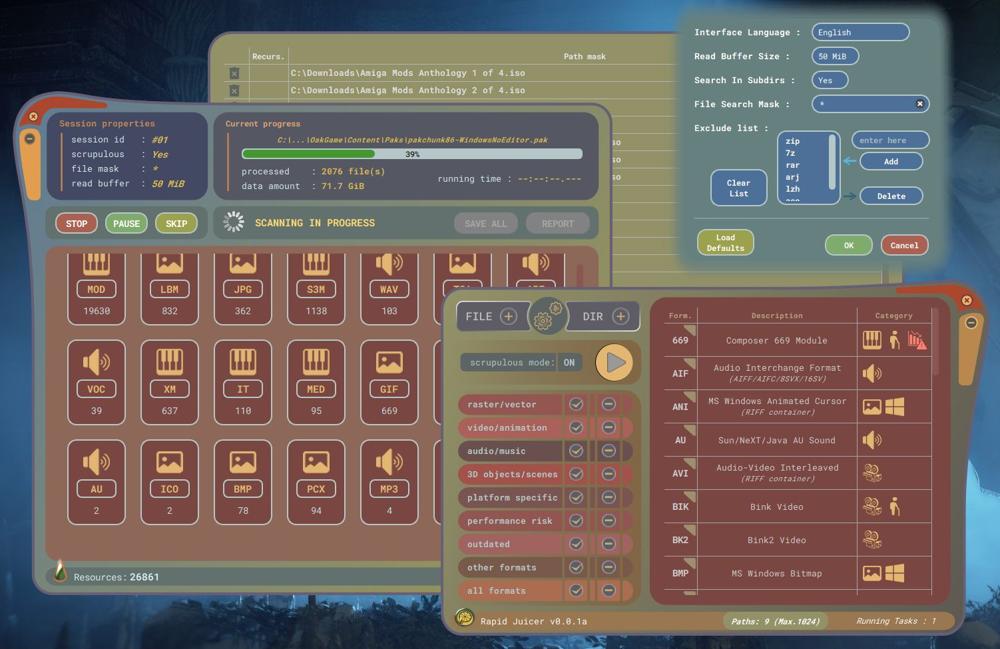
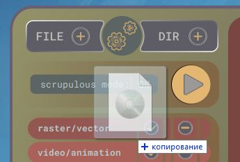
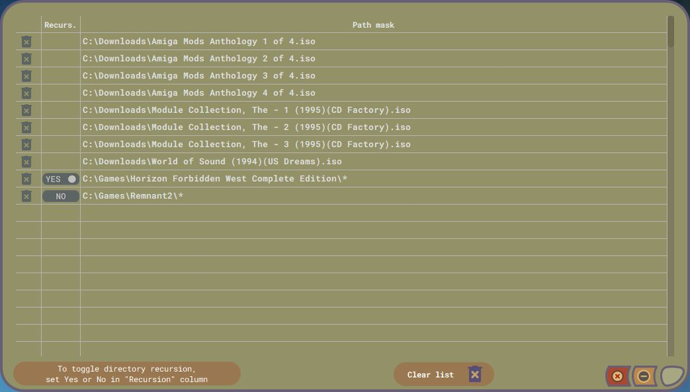
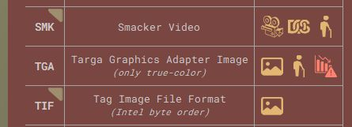
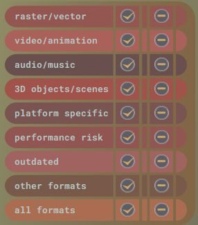
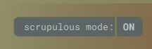
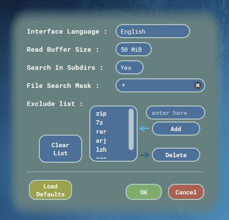
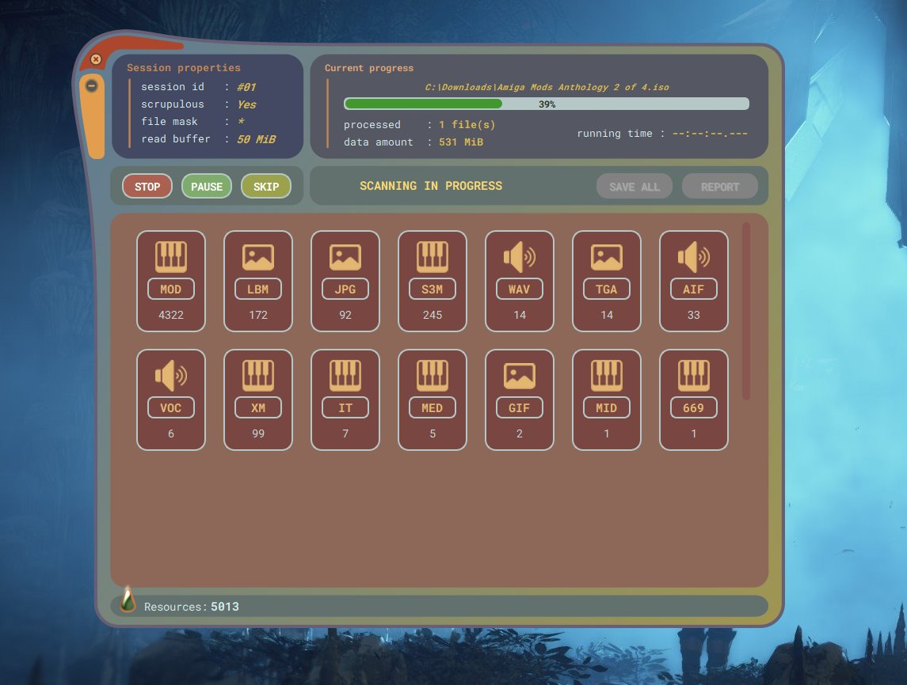
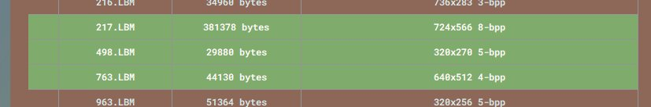
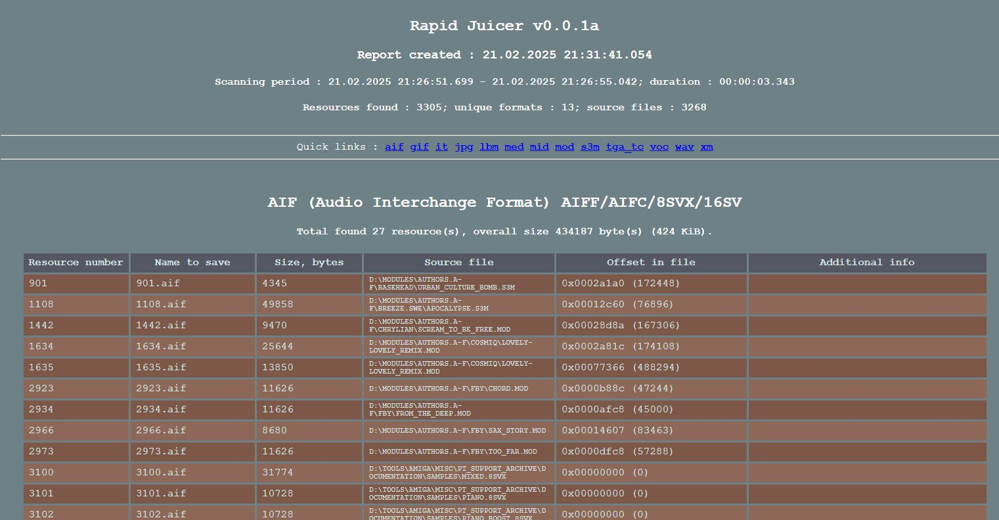

# Rapid Juicer :: Resource Extractor
**Приложение для поиска мультимедийных ресурсов внутри массивов данных, не сжатых архиваторами.**

Для добывания звука, музыки, видео, растровых и иных типов ресурсов из :

 - игр (особенно старых)
 - демо (demo-scene)
 - исполняемых файлов, библиотек
 - ISO-образов дисков
 - любых других видов файлов (кроме сжатых или зашифрованных)

Не является определителем внутреннего формата файла, хотя и для этого тоже может использоваться.

Будет полезно в reverse engineering'е для поиска встроенных или намеренно спрятанных ресурсов.

[>>> Инсталлятор под Win64 <<<](https://github.com/fluorohead/rapid_juicer/releases/download/v0.0.1a/rapid_juicer-0.0.1a-windows-x64.exe)

## Поддержка форматов

### Изображения :
|Формат|Название|Описание|
|--|--|--|
|ANI|Windows Animated Cursor|Использует контейнер RIFF, платформа Windows.|
|BMP|Windows Bitmap|Нативный формат растра для Windows, совместимый с Win32 API.|
|CUR|Windows Cursor|Растровый курсор. **Нечёткая сигнатура, пересекающаяся с TGA, поэтому рекомендуется включать поиск формата только при необходимости из-за возможного падения производительности**.|
|GIF|Graphics Interchange Format|Всё ещё один из основных Internet-форматов графики, хотя поддерживает только 256 цветов палитры.|
|ICO|Windows Icon|Растровая иконка. Поддерживаются т.н. Vista-иконки со встроенным PNG. **Нечёткая сигнатура и падение производительности поиска, подобно форматам CUR и TGA.**|
|JPG|JPEG File Interchage Format|Самый распространённый формат сжатия с потерями, а точнее формат хранения и обмена JPEG-данными.|
|LBM|Interleaved Bitmap|Родной формат для Amiga, но встречается не только там. Использует IFF-контейнер. Имеет субформаты : PBM, RGB8, ACBM, ILBM, RGBN, DEEP.|
|PCX|Zsoft PC Paintbrush|Чаще встречается на платформе DOS. Имеет несколько разновидностей. Rapid Juicer'ом поддерживается версия формата PCXv3.0.|
|PNG|Portable Network Graphics|Наряду с GIF и JPG является одним из самых распространённых форматов в Internet.|
|TGA|Targa Graphics Adapter Image|**Из-за нечёткой сигнатуры снижает производительность, поэтому рекомендуется включать только по необходимости**. Rapid Juicer'ом распознаются true-color разновидности (тип 2 и тип 10).|
|TIF|Tag Image File Format|Поддерживает множество видов сжатий. Очень мощный и расширяемый. В одном ресурсе могут присутствовать сразу несколько независимых изображений.|

### Видео и анимация :
|Формат|Название|Описание|
|--|--|--|
|AVI|Audio-Video Interleaved|Использует контейнер RIFF. Чаще встречается на платформе Windows.|
|BIK|Bink Video|Устаревший формат видео для игр.|
|BK2|Bink2 Video|Обновлённый формат видео для игр, пришедший на смену Bink.|
|FLC|Flic Animation|Анимация (без звука), подготовленная в приложении Autodesk Animator. Чаще встречается в играх на платформе DOS. Rapid Juicer'ом поддерживаются варианты : FLI, FLС и FLX.|
|MOV|QuickTime Movie|Видео с платформы Apple, но имеет распространение на всех остальных.
|MP4|MPEG-4 Video|Видео стандарта ISO/EIC 14496-1/-14. Использует контейнер, аналогичный Apple QuickTime MOV.|
|OGG|OGG Video|Использует контейнер OGG.
|SMK|Smacker Video|Устаревший формат фреймворка RAD Game Tools. Предшественник Bink Video.|

### Аудио и музыка :
|Формат|Название|Описание|
|--|--|--|
|669|Composer 669 Module|Треккерная музыка с платформы DOS. **Формат имеет очень распространённую сигнатуру, поэтому относится к категории Performance Risk. Рекомендуется включать только по мере необходимости**.|
|AIF|Audio Interchange Format|Сэмпловый формат, родившийся на платформе Amiga, но затем перешедший на Apple и не только. Использует IFF-контейнер. Встречается везде. Rapid Juicer'ом поддерживаются субформаты : AIFC, AIFF, 8SVX, 16SV.|
|AU|Sun/NeXT/Java AU sound|Впервые появился на Unix-like платформах. Может встречаться внутри java-апплетов.|
|DBM|DigiBooster Pro Module|Формат соответствующего треккера платформы Amiga. В основном распространён только там.|
|IT|Impulse Tracker Module|Треккерная музыка очень популярной (в прошлом) программы. Один из последних легендарных треккеров под DOS.|
|MED|OctaMED Module|Треккерная музыка, платформа Amiga, от профессионального коммерческого ПО OctaMED.|
|MID|Standard MIDI Music|Формат, стандартизированный комитетом MIDI. Содержит нотные данные и проигрывается на всех известных платформах, а так же студийном оборудовании.|
|MOD|Tracker Module|Появился на платформе Amiga. Получил повсеместное распространение и поддержку, особенно в треккерах под DOS. Имеет несколько разновидностей, распознаваемых Rapid Juicer'ом : M.K., xCHN и xxCH.|
|MP3|MPEG-1 Layer III Audio|Наиболее распространённый формат сжатия звука с потерями.|
|OGG|OGG Audio|Аудио в контейнере OGG.|
|RMI|MIDI Music|Это MID-файл, интегрированный в RIFF-контейнер. Rapid Juicer сохранит его одновременно в двух вариантах : как MID и как RMI.|
|S3M|ScreamTracker 3 Module|Музыка соответствующего треккера. Платформа DOS.|
|VOC|Creative Labs Voice|Звуковой сэмпл собственного формата компании Creative. Встречается в старых играх.|
|WAV|Wave Audio Data|Чаще PCM-сэмпл. Поддерживается огромное количество иных типов сжатий. Распространён повсеместно. Использует RIFF-контейнер.|
|XM|FastTracker II Module|Музыкальный формат соответствующего DOS-треккера.|
|XMI|eXtended MIDI Music|Формат фреймворка Miles Sound System, midi-данные. Использует RIFF-контейнер. Чаще встречается в играх под DOS-платформу.|

### Другие :
|Формат|Название|Описание|
|--|--|--|
|TTF|TrueType/OpenType Font|Шрифт в указанных форматах.|

## Начало работы

Приложение поддерживает многозадачность : можно запустить до 16 сканирований одновременно. Но необходимо понимать, что прироста производительности нельзя получить, если несколько потоков работают с одним разделяемым файловым хранилищем (устройством).

Работа начинается с формирования задания путём добавления путей к отдельным файлам или каталогам. В одно задание можно добавить не более 1024 путей. Если в каталоге более 1024 файлов, то просто добавьте целый каталог. Одно задание (сессия сканирования) работает в рамках отдельного потока операционной системы. Если вы запустили задачу, то приложение уже готово сформировать следующую и запустит его так же в отдельном потоке.

Добавить пути поиска можно кнопоками FILE+ и DIR+ главного окна приложения либо через drag-and-drop.

Список добавленных путей можно просмотреть и отредактировать, нажав кнопку Paths в нижней части главного окна. Откроется окно списка добавленных путей.

Можно удалить любую строку, либо очистить весь список сразу. Режим рекурсии для каталогов выставляется глобальной настройкой в Свойствах (Settings), но в данном списке есть возможность переопределить его для каждого каталога в отдельности.

Программа даёт возможность выбора форматов для поиска. По-умолчанию выбраны все, но можно индивидуально отключить любой с целью ускорения процесса сканирования. Например, если есть уверенность, что в сканируемом массиве данных точно нет ресурсов TGA, то можно исключить TGA путём клика на соответствующей строке в списке форматов (зелёный треугольник пропадёт).

Некоторые форматы могут несколько снижать производительность приложения из-за своих нечётких сигнатур. Это означает, что алгоритм поиска будет чаще вызывать функции распознавания. В результате могут быть обнаружены ложные ресурсы, которые невозможно открыть в приложениях просмотра. Это не страшно, но нужно учитывать. К таким форматам относятся : TGA и 669. В меньшей степени : CUR, ICO и MP3. На первых два приходится наибольшее количество ложных срабатываний, т.к. сигнатуры очень распространены и поэтому встречаются практически везде. Очень сложно отказаться от MP3, но и не надо, а вот TGA и 669 рекомендуется включать в поиск только по мере необходимости. Такие форматы относятся к категории "Сложные" ("Performance risk").

Переключать поиск каждого формата в отдельности может быть утомительным занятием. Все форматы в Rapid Juicer входят в одну или, что чаще, сразу в несколько категорий. Поэтому для удобства были добавлены кнопки быстрого выбора.

На главное окно так же выведена кнопка "Режима Тщательности" (Scrupulous mode). По-умолчанию On, т.е. включено. При такой настройке сканирование происходит несколько медленнее, но повышается вероятность нахождения б**о**льшего количества ресурсов за счёт пересканирования внутри уже найденных. При отключении тщательного режима пересканирования не происходит. На современных производительных системах рекомендуется оставить в On.

Кнопка с шестерёнками ведёт к общим настройкам приложения.

Здесь можно переключить язык. Доступны только два : русский и английский. Добавление новых не планируется, хотя возможно, если будет запрос и появится человек, готовый перевести все строки приложения.

Настройка Read Buffer Size имеет устаревшее название, но было решено так и оставить. Фактически здесь выбирается константа, влияющая на управление потоком сканирования. Если вы сканируете сетевой файл, то чем меньше буфер, тем быстрее вы сможете остановить сканирование кнопкой Стоп или поставить его на паузу кнопкой Пауза. В Rapid Juicer не используется "грязное" разрушение потоков через terminate, поэтому параметр Read Buffer Size всё ещё имеет значение. В случае быстрых систем с SSD-накопителями рекомендуется выбрать максимальное значение.

Настройка рекурсии каталогов влияет на обход субдиректорий. По-умолчанию включено, т.к. удобно запустить Rapid Juicer, например, на весь каталог "games".

Через модификацию файловой маски можно указать какие именно имена файлов нужно сканировать, а какие нет. По-умолчанию " \* " - все файлы будут сканироваться.

Обратите внимание, что это именно одна звёздочка, а не " \*.\* ", т.к. в последнем случае будут учитываться только файлы с расширениями. Файлы могут и не иметь расширений, поэтому правильнее использовать " \* " .

Еще ниже расположен список исключаемых расширений файлов. Сюда удобно добавить те, которые не имеет смысла сканировать. Например расширения известных архиваторов.

## Запуск сканирования

Если всё готово, запуск сканирования осуществляется кнопкой "Play" главного окна.

Появляется окно текущей сессии сканирования.

Блок кнопок "STOP/PAUSE/SKIP" управляет процессом поиска и позволяет соответственно : останавливать сессию без возможности возобновления, ставить сессию на паузу с возможностью мгновенного возобновления, и пропускать текущий файл.

Блок кнопок "SAVE_ALL/REPORT" не доступен, пока сессия сканирования не будет завершена естественным образом или через останов кнопкой "STOP".

В главной области, по мере сканирования, начинают появляются плитки найденных форматов - это таблица результатов по форматам. На каждой плитке в реальном времени обновляется число ресурсов данного вида.  Клик на плитке открывает таблицу результатов с подробным описанием каждого найденного ресурса - это таблица результатов по конкретному формату. Эта таблица так же обновляется в реальном времени. В нижней части расположена недоступная кнопка "save selected". Она станет доступной после завершения сканирования или принудительного останова.

По завершении сканирования кнопки "SAVE_ALL/REPORT" и "save selected" разблокируются.

SAVE ALL - сохраняет абсолютно все ресурсы всех найденных видов и закрывает окно текущей сессии.

Кнопка "save selected" под таблицей результатов отдельно взятого формата позволяет, соответственно, сохранить только явно выбранные ресурсы - клик по таблице выделяет строку зелёным.

REPORT - сохраняет html-отчёт по найденным ресурсам с подробным описанием каждого ресурса. Закрытие окна сессии не происходит - можно выполнить последующий SAVE ALL. Отчёт удобен для изучения статистики.

## Лицензия и другая информация
Вы можете использовать части данного кода в своём проекте, при условии, что ваш проект тоже имеет открытый исходный код. Копирование внешнего вида приложения не разрешено - нарисуйте собственный GUI. А ещё лучше нарисуйте скин для Rapid Juicer'а :)

Rapid Juicer :
 - написан на C++ с использованием фреймворка Qt 6.6.1 и большим количеством old C-style cast'ов (удобнее, чем нагромождение треугольных скобок)
 - использует стороннюю библиотеку asmjit : [документация](https://asmjit.com/) и [код](https://github.com/asmjit/asmjit)
 - использует свободный шрифт "Roboto Mono" by Christian Robertson : [fonts.google.com](https://fonts.google.com/?query=Christian+Robertson)
 - использует иконки, предоставляемые в общий доступ сайтом [icons8.com](https://icons8.com/)

## Полезные ресурсы с информацией о форматах и образцами файлов :
 - [multimedia.cx](https://multimedia.cx/)
 - [moddingwiki.shikadi.net](https://moddingwiki.shikadi.net)
 - [video game music preservation foundation](https://www.vgmpf.com)
 - [fileformats.archiveteam.org](http://fileformats.archiveteam.org/wiki/Main_Page)
 - [media foundation and directshow media types](https://gix.github.io/media-types/)
 - [fileformat.info](https://www.fileformat.info/)
 - [lclevy's reverse engineering file formats](http://lclevy.free.fr/)
 - [martin reddy's the graphics file format page](https://martinreddy.net/gfx/)
 - [corkami](https://github.com/corkami/pics/blob/master/binary/README.md)
 - [wiki.amigaos.net](https://wiki.amigaos.net/wiki/IFF_Standard)
 - [textfiles.com](http://www.textfiles.com/programming/FORMATS/)
 - [tiff_tags](https://www.loc.gov/preservation/digital/formats/content/tiff_tags.shtml)
 - [samples.mplayerhq.hu](https://samples.mplayerhq.hu/)
 - [sembiance.com](https://sembiance.com/)
 - [ftp.modland.com](https://ftp.modland.com/pub/modules/)
 - [modsamplemaster.thegang.nu](https://modsamplemaster.thegang.nu/)
 - [www.exotica.org.uk](https://www.exotica.org.uk/wiki/Special:Modland)
 