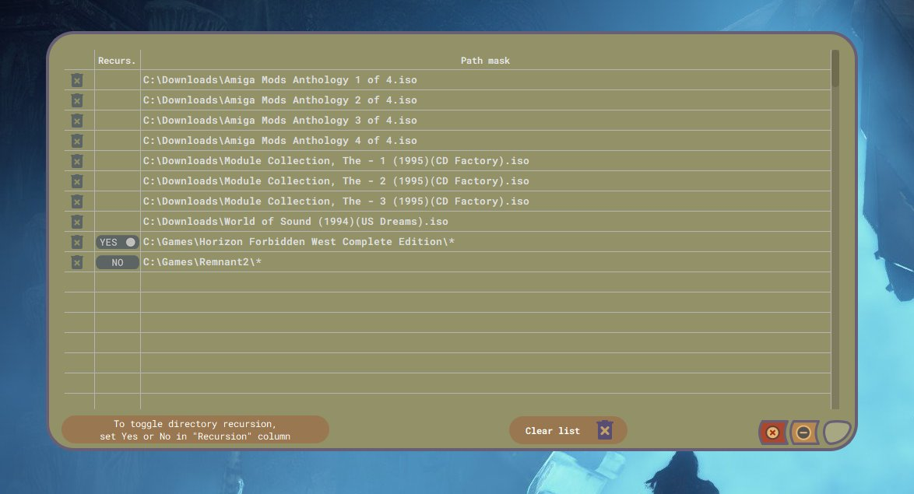

# Rapid Juicer :: Resource Extractor
**Приложение для поиска мультимедийных ресурсов внутри любых файлов, не сжатых архиваторами.**

Полезно для добывания звука, музыки, видео, растровых, векторных и иных типов ресурсов из :

 - игр (особенно старых)
 - демо
 - исполняемых файлов
 - любых других видов файлов

Это не определитель внутреннего формата файла, хотя может использоваться и для этого.

Будет полезна в reverse engineering'е для поиска встроенных или намеренно спрятанных ресурсов.

## Поддержка форматов

### Изображения :
|Формат|Название|Описание|
|--|--|--|
|ANI|Windows Animated Cursor|Использует контейнер RIFF, платформа Windows.|
|BMP|Windows Bitmap|Нативный формат растра для Windows.|
|CUR|Windows Cursor|Растровый курсор. **Нечёткая сигнатура, пересекающаяся с TGA, поэтому рекомендуется включать поиск этого формата только по необходимости по причине общего падения производительости поиска**.|
|GIF|Graphics Interchange Format|Всё ещё один из основных Internet-форматов графики, хотя поддерживает всего-лишь 256 цветов палитры.|
|ICO|Windows Icon|Растровая иконка. Поддерживаются встроенные PNG (Vista-иконки). **Нечёткая сигнатура и падение производительности поиска, подобно форматам CUR и TGA.**|
|JPG|JPEG File Interchage Format|Самый распространённый формат сжатия с потерями.|
|LBM|Interleaved Bitmap|Родной формат для Amiga, но встречается не только там. Использует IFF-контейнер. Имеет субформаты : PBM, RGB8, ACBM, ILBM, RGBN, DEEP.|
|PCX|Zsoft PC Paintbrush|Чаще встречается на платформе DOS. Имеет несколько разновидностей. Rapid Juicer'ом поддерживается только формат PCXv3.0.|
|PNG|Portable Network Graphics|Наряду с GIF и JPG является одним из самых распространённых форматов в Internet.|
|TGA|Targa Graphics Adapter Image|Уже сильно устаревший формат, чаще встречающийся на платформе DOS. **Из-за нечёткой сигнатуры TGA снижает производительность поиска, поэтому рекомендуется включать поиск этого формата только по необходимости**. Rapid Juicer'ом поддерживаются true-color разновидности (тип 2 и тип 10).|
|TIF|Tag Image File Format|Поддерживает множество видов сжатий. Очень мощный и расширяемый. В одном ресурсе может присутствовать сразу несколько независимых изображений.|

### Видео и анимация :
|Формат|Название|Описание|
|--|--|--|
|AVI|Audio-Video Interleaved|Использует контейнер RIFF. Чаще встречается на платформе Windows.|
|BIK|Bink Video|Устаревший формат видео для игр.|
|BK2|Bink2 Video|Обновлённый формат видео для игр, пришедший на смену Bink.|
|FLC|Flic Animation|Анимация (без звука), подготовленная в приложении Autodesk Animator. Чаще встречается в играх на платформе DOS. Rapid Juicer'ом поддерживаются варианты FLI, FLС и FLX.|
|MOV|QuickTime Movie|Видео с платформы Apple.
|MP4|MPEG-4 Video|Видео стандарта ISO/EIC 14496-1/-14. Использует контейнер, аналогичный Apple QuickTime MOV.|
|OGG|OGG Video|Использует контейнер OGG.
|SMK|Smacker Video|Устаревший формат фреймворка RAD Game Tools. Предшественник Bink Video.|

### Аудио и музыка :
|Формат|Название|Описание|
|--|--|--|
|669|Composer 669 Module|Треккерная музыка с платформы DOS. **Формат имеет очень распространённую сигнатуру, поэтому относится к категории Performance Risk. Рекомендуется включать его только по мере необходимости**.|
|AIF|Audio Interchange Format|Сэмпловый формат, родившийся на платформе Amiga, но затем перешедший на Apple и не только. Использует IFF-контейнер. Встречается везде. Rapid Juicer'ом поддерживаются субформаты : AIFC, AIFF, 8SVX, 16SV.|
|AU|Sun/NeXT/Java AU sound|Появился на Unix-like платформах. Может встречаться внутри java-апплетов.|
|DBM|DigiBooster Pro Module|Формат соответствующего треккера платформы Amiga. В основном распространён только там.|
|IT|Impulse Tracker Module|Треккерная музыка очень популярной (в прошлом) программы. Встречается повсеместно.|
|MED|OctaMED Module|Треккерная музыка, платформа Amiga, профессиональное коммерческое ПО.|
|MID|Standard MIDI Music|Формат, стандартизированный комитетом MIDI. Содержит нотные данные и проигрывается на всех известных платформах.|
|MOD|Tracker Module|Появился на платформе Amiga, но получил распространение и поддержку повсеместно, особенно в треккерах под DOS. Имеет несколько разновидностей, которые Rapid Juicer распознаёт : M.K., xCHN и xxCH.|
|MP3|MPEG-1 Layer III Audio|Наиболее распространённый формат сжатия с потерями.|
|OGG|OGG Audio|Аудио в контейнере OGG.|
|RMI|MIDI Music|Это MID-файл, интегрированный в RIFF-контейнер. Rapid Juicer сохранит его одновременно в двух вариантах : как MID и как RMI.|
|S3M|ScreamTracker 3 Module|Музыка соответствующего треккера. Платформа DOS.|
|VOC|Creative Labs Voice|Звуковой сэмпл от собственного формата компании Creative. Встречается в старых играх.|
|WAV|Wave Audio Data|Чаще PCM-сэмпл, но так же поддерживается огромное количество иных типов сжатий. Распространён повсеместно. Использует RIFF-контейнер.|
|XM|FastTracker II Module|Музыкальный формат соответствующего DOS-треккера.|
|XMI|eXtended MIDI Music|Формат фреймворка Miles Sound System, midi-данные. Использует RIFF-контейнер. Чаще встречается в играх под DOS-платформу.|

### Другие :
|Формат|Название|Описание|
|--|--|--|
|TTF|TruType/OpenType Font|Шрифт в указанных форматах.|

## Начало работы

Приложение поддерживает многозадачность, т.е. можно запустить несколько сканирований одновременно, но не более 16. Необходимо понимать, что прироста производительности не будет, если несколько потоков работают с одним разделяемым файловым хранилищем (устройством).

Работа начинается с формирования задания путём добавления путей к отдельным файлам или каталогам. В одно задание можно добавить не более 1024 путей. Если в вашем каталоге более 1024 файлов, то просто добавьте целый каталог, а не файлы по-отдельности. Одно задание (сессия сканирования) работает в рамках отдельного потока операционной системы. Если вы запустили задачу, то приложение готово сформировать следующую и запустит его тоже в своём отдельном потоке.

Добавить пути поиска можно кнопоками FILE+ и DIR+ главного окна приложения либо через drag-and-drop.

Список добавленных путей можно просмотреть и отредактировать перед запуском сканирования, нажав кнопку Paths в нижней части главного окна. Откроется окно списка добавленных путей.

Здесь можно удалить отдельно взятый путь, либо очистить весь список сразу.
Для каталогов можно индивидуально переключить режим рекурсии в столбце Recurs.
Режим рекурсии, с которым каталоги попадают в список, выставляется глобальной настройкой в Свойствах (Setting).

Далее, программа даёт возможность выбрать форматы для поиска. По-умолчанию выбраны все, но можно индивидуально отключить любой с целью ускорения поиска. Например, если есть уверенность, что в сканируемом массиве данных точно нет ресурсов TGA, то можно исключить его путём клика на соответствующей строке в списке форматов (зелёный треугольник пропадёт).

Некоторые форматы могут несколько снизить производительность из-за своих нечётких сигнатур. Это означает, что алгоритм поиска будет чаще вызывать функции распознавания. В результате ничего не будет найдено, либо найдутся ложные ресурсы, которые невозможно открыть в приложениях просмотра. Это не страшно, но нужно учитывать. К таким форматам относятся : TGA и 669. В меньшей степени : CUR, ICO и MP3. На первые два приходится наибольшее количество ложных срабатываний, т.к. сигнатуры очень распространены и поэтому крайне часто встречаются практически везде. Очень сложно отказаться от MP3, но и не надо, а вот TGA и 669 рекомендуется включать только по мере необходимости.

Все форматы в Rapid Juicer имеют категорию. И переключать поиск индивидуально каждого формата может быть утомительным занятием. Поэтому в главном окне были добавлены кнопки быстрого выбора по категории.

На главное окно выведена кнопка "Режима Тщательности" (Scrupulous mode). По-умолчанию режим On, т.е. включен. При такой настройке сканирование происходит несколько медленнее, но повышается вероятность нахождения б**о**льшего количества ресурсов за счёт пересканирования внутри уже найденных. При отключении такого пересканирования не произойдёт. На современных производительных системах рекомендуется оставить в On.

